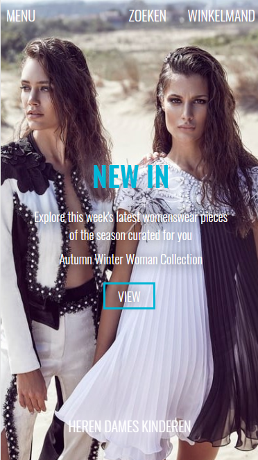
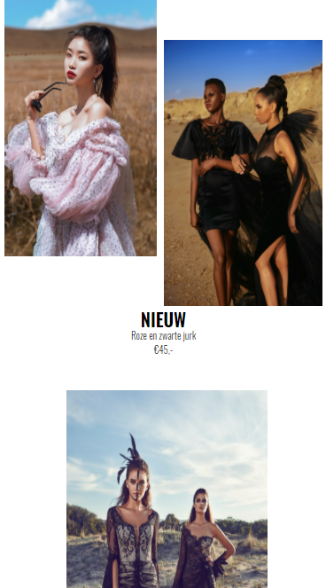
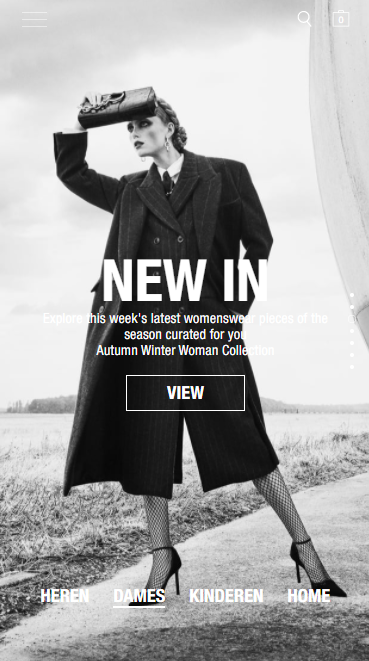
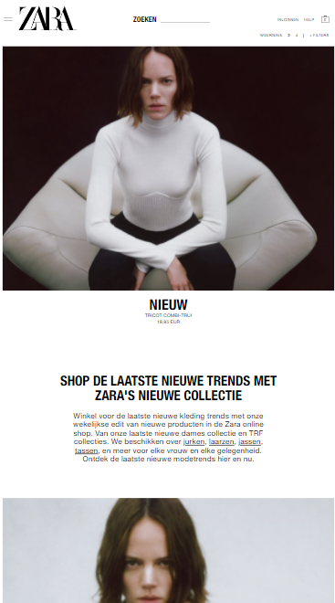
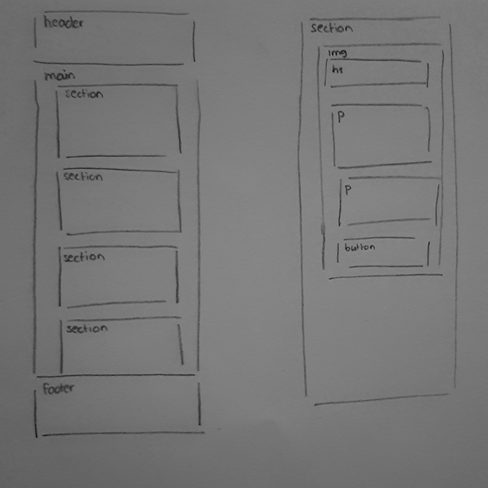

# Procesverslag
**Auteur:** Merel Jansma

Markdown cheat cheet: [Hulp bij het schrijven van Markdown](https://github.com/adam-p/markdown-here/wiki/Markdown-Cheatsheet). Nb. de standaardstructuur en de spartaanse opmaak zijn helemaal prima. Het gaat om de inhoud van je procesverslag. Besteedt de tijd voor pracht en praal aan je website.

## Bronnenlijst
1. https://www.zara.com/nl/ voorbeeld
2. https://unsplash.com/ afbeeldingen (ook de afbeeldingen in de video)
3. https://www.w3schools.com/ 
4. https://developer.mozilla.org/nl/ 

## Feedback eindgesprek (week 7/8)
Ik moet voor de herkansing nog wat interacties toevoegen aan de site. Bijvoorbeeld een animatie. Ook werkte mijn javascript nog niet, dus daar moet ik even twee dingen omdraaien om het wel te laten werken. 
Mijn code was netjes, dus daar hoef ik verder niets meer aan te veranderen. 

## Eindgesprek (week 7/8)

Goed:
Het toevoegen van de content in html.

Minder Goed:
Ik had soms wat problemen met stukken code, omdat het dan gewoon niet deed wat ik wilde. Ik had bijvoorbeeld aan het begin een aantal keer gebruik gemaakt van nth-of-type, maar ik kwam bij mijn tweede scherm daarmee in de problemen. Toen begon het raar te doen. Uiteindelijk ben ik dus maar gaan werken met classes. Ook wilde ik gebruik maken van een grid, dit ging goed bij een deel van de content.

**Screenshot(s):**

## Voortgang 2 (week 5)

### Stand van zaken

Goed:
Ik heb eindelijk mijn tekst goed gekregen per afbeelding. 

### Agenda voor meeting
- Ik had eigenlijk geen vragen, omdat de onderdelen die ik toe had gevoegd waren gelukt. 

### Verslag van meeting
Ik liep nog steeds achter en moest me vooral gaan focussen op het maken van m'n tweede scherm en het toevoegen van een functie door middel van javascript.

## Voortgang 1 (week 3)

### Stand van zaken

Goed:
de basis html code ging goed, ik wist wat ik wilde toevoegen.

Minder goed:
mijn tekst wil niet naar beneden. Bij alle afbeeldingen moet een stukje tekst. Bij de eerste afbeelding gaat dat goed, de tekst staat waar het moet staan. Alleen wanneer ik de tekst voor de tweede afbeelding wil toevoegen staat alles door elkaar. Ik krijg het dan niet naar beneden. Ik wilde gebruik maken van de ..-of-type, maar dat vind ik toch nog wel lastig. Misschien ligt daar het probleem van de tekst ook wel. 

### Agenda voor meeting

Luuk: 
- Z-Index voor overlay van images.
- Tips en Tricks javascript.

Salwa:
- Hoe je een nav kan veranderen in een hamburger menu wanneer het scherm kleiner wordt.

Tessa:
- Kan je met media queries bepalen of er sprake is van een touchscreen of desktop? En zo ja welke?

Merel:
- nth-of-type.
- Hoe krijg je het menu zo dat je er alleen overheen hoeft te gaan met je muis om het te openen. (dus zonder erop te klikken).

### Verslag van meeting

Ik loop iets achter, maar dat wist ik zelf eigenlijk al. Verder heb  ik twee vragen gesteld. Voor mijn menu moet ik javascript gaan gebruiken (mouse over). Verder heb ik overal position absolute staan alleen wilde mijn teksten daardoor niet naar beneden, dus moet het veranderd worden naar relative.  

## Intake (week 1)

**Je startniveau:** blauw/rood

**Je focus:** surface plane

**Je opdracht:** https://www.zara.com/nl/

**Screenshot(s):**

 
  

**Breakdown-schets(en):**

